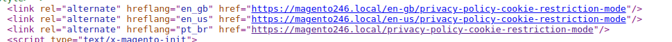

# Meta Tag em Multi-site

> Esse repositório é um desafio técnico para vaga de Desenvolvedor Magento 2

## Ambiente de desenvolvimento
- Magento 2.4.6
- PHP FPM 8.1
- Nginx 1.18
- Mariadb 10.4
- Redis 6.2

## Instruções

1. Para rodar esse projeto bastar executar esse comando dentro da pasta app/code `git clone https://github.com/kelvysmoura/module-metatag.git Kelvysmoura/Metatag`
2. Execute o comando `bin/magento setup:upgrade`
3. Condifgurar mais de uma visão de loja
4. Configurar uma url para cada visão
3. Criar uma página CMS
4. Acessar a página CMS e verificar a meta tag no head do html

## Problema e Solução

O cliente tem uma configuração multi-site com algumas páginas CMS que são compartilhadas entre diferentes sites,
porém isso está causando problemas de conteúdo duplicado e afetando seus rankings de SEO.

Uma possível solução é aplicar a meta tag com o atributo hreflang. A tag `<link rel="alternate" hreflang="LOCALE" href="URL">` é
usada para informar aos mecanismos de busca o idioma e a região de uma determinada página. Usando essa tag,
você pode indicar ao Google, por exemplo, que uma página está disponível em vários idiomas ou regiões e assim
melhorar a relevância nos resultados de pesquisa.

## Requisitos

1. Adicione um bloco ao head
2. O bloco deve ser capaz de identificar o ID da página CMS e verificar se a
   página é usada em múltiplas store-views
3. Nesse caso, deve adicionar uma Meta Tag hreflang ao head para cada
   store-view que a página esteja ativa
4. As Meta Tags devem exibir o idioma da loja (exemplo: en-gb, en-us, pt-br,
   etc...)

## Concepção da Solução

De início criei uma estrutura padrão de um módulo Magento 2 e logo em seguida adicionei um o arquivo `default_head_blocks.xml` e
`metatag.phtml` para poder visualizar alguma coisa acontecendo no `<head>`.

Após visualizar um conteúdo de teste sendo exibido na tag head, comecei a criar a classe do bloco.
Esse bloco ao todo tem 3 métodos:

Método responsável por receber a instância de `Page` e retornar os IDs de todas as lojas que essa página está cadastrada.
Nesse método também tem uma pequena lógica para quando a página estiver cadastrada em todas as lojas.
```php
public function getPageStoreIds(Page $page)
{
   $storeIds = (array)$page->getStoreId();

   if(count($storeIds) === 1 && $storeIds[0] == 0) {
       return $this->_storeManager->getStore()->getWebsite()->getStoreIds();
   }

   return $storeIds;
}
```

Método responsável por gerar um array com informações dos atributos da meta tag
```php
public function buildMetatagAttribute(int|string $storeId, string $identifier): array
{
   $store = $this->_storeManager->getStore($storeId);

   $hreflang = $store->getConfig("general/locale/code");
   $href = $store->getBaseUrl() . $identifier;

   return [
       "hreflang" => strtolower($hreflang),
       "href" => $href,
   ];
}
```

Método responsável por retornar um array de itens onde cada é item é um array com informações dos atributos da meta tag.
Esse método faz uso dos outros dois já citados.
```php
public function getMetatagAttributes(): array
{

   $pageId = $this->getRequest()->getParam('page_id');

   if (empty($pageId)) {
       return [];
   }

   $page = $this->pageFactory->create()->load($pageId);

   $storeIds = $this->getPageStoreIds($page);

   return array_map(function ($storeId) use ($page) {
       return $this->buildMetatagAttribute($storeId, $page->getIdentifier());
   }, $storeIds);
}
```

> Testes unitários
>
> Os testes unitários não são requisitos desse desafio, porém como já faz um tempo que não escrevo testes para o magento
resolvi propor esse desafio a mais para "desenferrujar" o desenvolvimento de testes.
>
> Visualizando o core do magento e a documentação, criei casos de testes para cobrir 100% do `Block/Metatag.php`
>
> São 3 casos de teste
>
> 1. testGetMetatagAttributesWithPageIdNull
     >   - Cobre o caso em que page_id da requisição não retorna um ID da loja e o método precisa retornar um array vazio.
> 2. testGetMetatagAttributesWithPageForAllStores
     >   - Cobre o caso em que o page_id retorno apenas um id de valor 0. Nesse caso o método `getPageStoreIds` precisa entrar no
           >   que retorna o ID de todas as lojas.
> 3. testGetMetatagAttributesForTwoStores
     >   - Cobre o caso em que o page_id da requisição retornar 2 ids. Nesse caso o método `getPageStoreIds` precisa pular o if e retornar os id da página.

## Exemplo do resultado esperado



